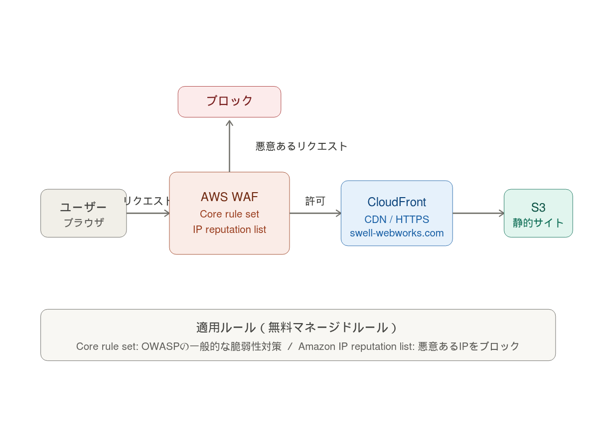

# AWS WAF + CloudFront 構成

## 概要
AWS WAF を CloudFront に適用し、Webアプリケーションへの攻撃から
保護する構成を実装しました。

## アーキテクチャ

## 使用サービス
- AWS WAF（Web ACL）
- Amazon CloudFront
- AWS Managed Rules

## 適用したルール
- Core rule set（OWASPの一般的な脆弱性対策）
- Amazon IP reputation list（悪意のあるIPをブロック）

## 構成のポイント
- CloudFrontディストリビューションにWAFを紐付け
- マネージドルールにより追加コストなしで基本保護を実現
- ブロックされたリクエストはCloudWatchで確認可能

## 目的
Webアプリケーションへの不正アクセスを防ぎ、安全な配信環境を構築するため

## 課題
・SQLインジェクションやXSSなどの攻撃リスク  
・不正アクセスやBotによる負荷増加  
・セキュリティ対策なしでは脆弱性が残る  

## 解決
・AWS WAFをCloudFrontに紐付けて防御を実装  
・マネージドルール（OWASP）を適用し基本防御を実現  
・IPレピュテーションリストで悪意あるアクセスをブロック  
・CloudFront経由でのみアクセスを許可  

## 結果
・一般的なWeb攻撃の防御を実現  
・不正アクセスの遮断に成功  
・セキュアな配信環境を構築  

## 工夫した点
・マネージドルールを活用し、運用コストを抑えつつセキュリティ強化  
・CloudFrontと連携することで高速かつ安全な配信を実現  

## 改善点
・レート制限ルールを追加しDDoS対策を強化  
・ログ分析基盤（S3 + Athena）の導入を検討  
・CloudWatch連携によるリアルタイム監視の強化  
